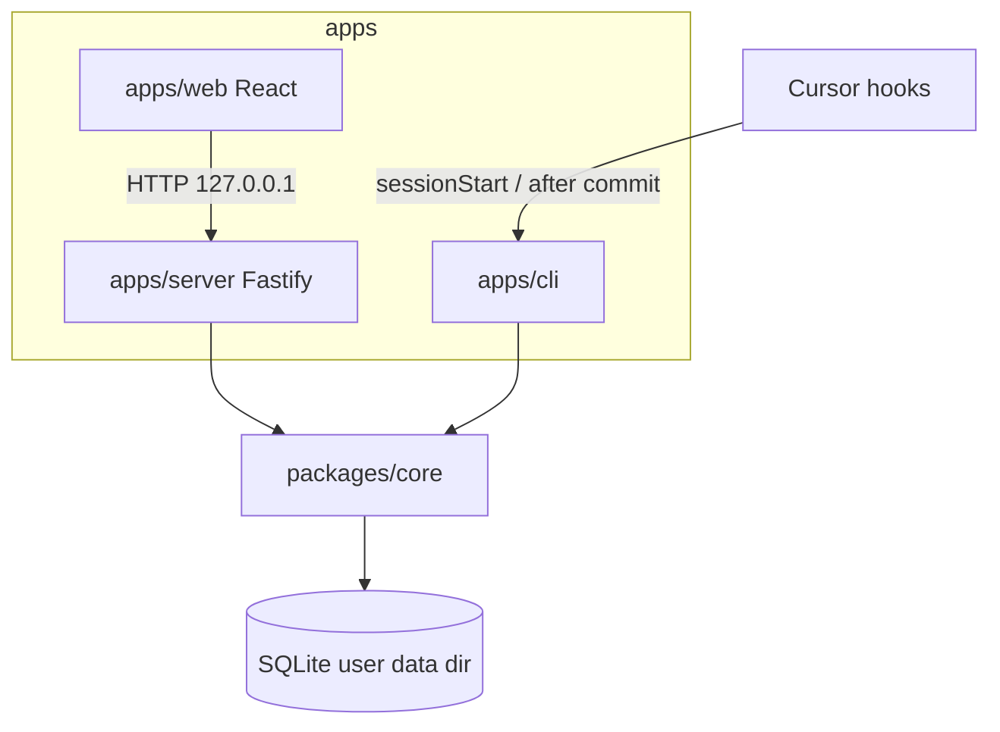
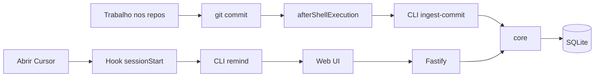

# QuestLog — plano

## Decisões travadas (grilling)

| Tema | Decisão |
|------|---------|
| Produto | Local-first; **sem** Vercel/cloud obrigatório; custo infra = R$ 0 |
| Núcleo vs realidade | Núcleo magro; empresa/ticket/repos vivem em **perfil configurável** |
| Persistência | **SQLite** (arquivo local), schema + migrations via TypeORM |
| Arquitetura | `core` + adapters: **HTTP** (UI), **CLI** (hooks) |
| Stack | Vite + React + TS + Tailwind + TanStack Query \| Fastify + TypeORM (Active Record) \| SQLite |
| Config | Settings/perfil **na SQLite**; wizard se vazio + seeds de exemplo |
| Perfis | Tabela `profiles` com **1** ativo no MVP; multi-perfil na fase 2 |
| Hooks Cursor | CLI → `core` (não depende do server); UI → HTTP; **fail-open** |
| Concorrência | WAL + transações curtas **só** no `core` |
| Dados | Diretório do usuário (`getDataDir()`); `QUESTLOG_DATA_DIR` opcional; **nunca** commitar `.db` |
| Match de commit | ticket → branch → quest ativa → Inbox |
| Desktop | **Electron** (fase 4); shell reusa `core` + API + mesmo `getDataDir()`; Tauri / auto-update / code signing = depois |
| Monorepo | pnpm workspaces: `packages/core`, `apps/server`, `apps/web`, `apps/cli` |
| Lembrete | `sessionStart` sempre; texto muda se API estiver down |

Critério permanente: **melhor arquitetura**, não o caminho mais fácil.

---

## Visão de produto

QuestLog é um **quadro pessoal de trabalho em andamento**: a unidade de verdade é a **quest** (“o que estou tocando agora”), não o card do Jira/Linear/etc.

- **Você** usa no dia a dia (ex.: realidade Gran via seed/perfil).
- **Outras pessoas** configuram paths dos repos, regex de ticket, URL base, se há epic — sem fork do produto.
- **Portfólio**: app local full-stack real (API + SQLite + React), sem vazar dados de empresa.

Instalável = Electron (fase 4): mesmo `core`, mesma API, outro invólucro. Tauri / auto-update / signing = depois.

---

## Conceitos (não misturar)

| Conceito | O que é |
|----------|---------|
| **Quest** | Unidade do quadro: título, status, `falta`, repos/branches, tickets |
| **Profile** | Realidade da pessoa: repos monitorados, padrão de ticket, `has_epic`, locale |
| **Ticket** | ID externo genérico (`HESEC-6675`, `PROJ-12`, …) — formato vem do perfil |
| **Epic** | Opcional (`profile.has_epic`); contexto, não é a quest automaticamente |
| **Branch** | Fio técnico; a quest lista `repo → branch` |
| **Pendência (`falta`)** | Texto “o que falta” ao pausar — evita perder contexto |
| **Inbox** | Destino de commits que não casaram com quest |
| **Sprint (resumo)** | Intervalo **manual** nas Settings; texto incremental do que você **fechou** no QuestLog nesse intervalo (data de fechamento enriquecida pelo Jira quando existir) |

---

## Perfil configurável (não hardcode Gran)

Campos do perfil (SQLite):

| Campo | Função | Exemplo seed Gran |
|-------|--------|-------------------|
| `repos[]` | nome + path absoluto | es-api, es-secretaria, es-campus |
| `ticket.pattern` | regex para commits/branches | `HESEC-\\d+` |
| `ticket.prefix_label` | label na UI | `Jira` |
| `ticket.base_url` | link clicável | `https://…/browse/` |
| `ticket.has_epic` | liga epic + `epic_scope` | `true` |
| `branch_pattern` | opcional, inferência | `HESEC-\\d+` |
| `commit.hint` | ajuda na UI (não enforça) | use `#HESEC-XXXX` |
| `locale` | labels | `pt-BR` |
| `active_quest_id` | fallback de match | uuid \| null |

**Seed Gran** e **seed minimal** vivem em `examples/` (JSON → script de seed). Paths do seed Gran são placeholders ou os seus paths locais — **não** são o modelo do produto.

### Contexto Gran (apenas exemplo de perfil)

Útil para você e para o README; o código não assume isso.

- Keys: `HESEC-<número>`; epic = guarda-chuva; pegar tarefa ≠ pegar epic.
- Repos típicos: `es-api`, `es-secretaria`, `es-campus` (AVA pós fora).
- Commits: `#HESEC-XXXX` na mensagem; board extrai via `ticket.pattern`.
- `epic_scope`: `partial` (default) \| `full`.

---

## Arquitetura



### Monorepo

```
questlog/
  packages/core/          # domínio, TypeORM entities, use-cases, getDataDir(), WAL
  apps/server/            # Fastify: HTTP → core
  apps/web/               # Vite React Tailwind TanStack Query
  apps/cli/               # ingest-commit, remind, seed, setup
  examples/               # gran.profile.json, minimal.profile.json
  docs/PLAN.md            # este plano
  cursor/HOOKS.md         # instalação em ~/.cursor
```

### Regras do `core`

- Único lugar que fala com SQLite / TypeORM.
- CLI e server são adapters finos.
- `PRAGMA journal_mode=WAL` + busy timeout + transações curtas.
- Failures de hook/CLI: **fail-open** (nunca bloqueia `git commit`).

### Onde está o DB

- Default: diretório de dados do usuário (ex. `%APPDATA%/questlog/questlog.db` no Windows).
- Override: `QUESTLOG_DATA_DIR`.
- Repo git: só código + `examples/`; `.db` fora do versionamento.

---

## Modelo de dados (essencial)

### Profile

- campos da tabela acima
- MVP: um registro; fase 2: N perfis + `active_profile_id`

### Quest

- `id`, `titulo`
- `status`: `ativa` \| `pausada` \| `feita`
- `ticket_ids`: string[]
- `epic_id`: string \| null
- `epic_scope`: `partial` \| `full` (relevante se `has_epic`)
- `repos`: `{ nome, path, branch }[]`
- `falta`: string
- `atualizado_em`

### Commit

- `hash`, `repo`, `quando`, `assunto`, `resumo`, `quest_id` (ou Inbox)

### Resolução quest ← commit

1. IDs na mensagem ∩ `ticket_ids`
2. Match `branch_pattern` na branch do repo
3. `active_quest_id`
4. Inbox (criar/anexar) — não descartar

---

## Fluxo alvo



---

## UX (MVP)

- Wizard na primeira abertura se não houver profile.
- Lista: ativas / pausadas (+ Inbox).
- Detalhe: título, tickets linkados (`base_url` + id), repos/branches, **Falta** em destaque, timeline de commits.
- Ações: nova quest, pausar (exige `falta`), retomar, marcar feita, definir ativa.
- Settings: editar profile (paths, regex, URL, has_epic).
- Visual limpo (não dashboard corporativo genérico); UI em português no seed Gran / locale pt-BR.

Dev: `pnpm dev` sobe server + web (porta fixa, ex. `8787`).

---

## Integração Cursor (`~/.cursor`)

1. **`sessionStart`** → `questlog remind`  
   - Sempre lembra.  
   - Se API down: orientar `pnpm dev` / status.  
   - Se up: N ativas/pausadas + URL do board.

2. **`afterShellExecution`** → se `git commit` ok → `questlog ingest-commit`  
   - Detecta repo (cwd ∈ `profile.repos`)  
   - Lê `git log -1`  
   - Extrai tickets via `ticket.pattern`  
   - Resolve quest (ordem acima)  
   - Resumo: subject + `--stat` (MVP)  
   - Fail-open

---

## Fases

### Fase 1 — MVP usável no dia a dia

Entregar **uma fatia por vez**; review + commit antes da próxima.

| Fatia | Escopo | Commit sugerido |
|-------|--------|-----------------|
| **1.1** | Scaffold monorepo pnpm (`core`, `server`, `web`, `cli`), tsconfig base, `.gitignore` (`.db`, `node_modules`, `.env`) | `chore(repo): scaffold pnpm workspace` |
| **1.2** | `core`: `getDataDir()` + DataSource SQLite + WAL + runner de migrations (smoke) | `feat(core): bootstrap sqlite data dir and wal` |
| **1.3** | `core`: entities `Profile`, `Quest`, `Commit` + migration inicial | `feat(core): add profile quest commit schema` |
| **1.4** | `core`: use-cases de profile (get / upsert) | `feat(core): profile get and upsert` |
| **1.5** | `core`: quest CRUD + pausar com `falta` + status | `feat(core): quest crud and pause with falta` |
| **1.6** | `core`: `ingestCommit` (ticket → branch → ativa → Inbox) + check mínimo | `feat(core): resolve and ingest commits` |
| **1.7** | `examples/gran` + `examples/minimal` + CLI/core `seed` | `feat(cli): seed gran and minimal profiles` |
| **1.8** | `apps/server`: health + profile + quests + commits (adapter fino) | `feat(server): expose local http api` |
| **1.9** | `apps/cli`: `ingest-commit` + `remind` (fail-open; remind com healthcheck) | `feat(cli): ingest-commit and remind` |
| **1.10** | `apps/web` scaffold Vite/React/Tailwind/Query + fala com health | `feat(web): scaffold vite app with api health` |
| **1.11** | Web: wizard 1ª abertura + settings de profile | `feat(web): profile wizard and settings` |
| **1.12** | Web: board (lista/detalhe/falta/ações) | `feat(web): quest board list and detail` |
| **1.13** | `cursor/HOOKS.md` + README “como abrir de manhã” | `docs: add hooks guide and morning readme` |

Critério de pronto da Fase 1 = fatias **1.1–1.13** verdes + critérios de sucesso do MVP abaixo.

### Fase 2 — Atrito zero (multi-perfil depois)

Troca de perfil na UI fica **fora desta fase** (schema já tem `profiles`; UI de switch = futuro).

Entregar **uma fatia por vez**; review + commit antes da próxima.

| Fatia | Escopo | Commit sugerido |
|-------|--------|-----------------|
| **2.1** | Inferência de branch mais robusta no `ingestCommit` / match (padrões `feature/TICKET-…`, case, múltiplos tickets na branch) | `feat(core): polish branch ticket inference` |
| **2.2** | Pausar na UI: fluxo caprichado (`falta` obrigatório, confirmação clara, não dá para pausar sem texto) | `feat(web): polish pause quest with required falta` |
| **2.3** | Live update no board: polling leve em `atualizado_em` (quests/commits/profile) sem refresh manual | `feat(web): poll board for live commit updates` |
| **2.4** | (Opcional) Fila local se `ingest-commit` falhar — replay depois; senão manter só fail-open | `feat(cli): local ingest retry queue` |

Critério de pronto da Fase 2 = **2.1–2.3** verdes; **2.4** só se valer a dor no dia a dia.

### Fase 2b — Multi-perfil (futuro)

- UI de troca de perfil + N registros em `profiles`
- Não bloqueia 2.1–2.3

### Fase 3 — Ticket read-only (Jira)

Só **título + status** das keys já ligadas a quests. Nunca espelhar descrição do card. Credenciais Jira só em **env local** (não no profile/SQLite).

Entregar **uma fatia por vez**; review + commit antes da próxima.

| Fatia | Escopo | Commit sugerido |
|-------|--------|-----------------|
| **3.1** | Migration + campos na quest: `ticket_status`, `ticket_synced_at` | `feat(core): add quest ticket sync columns` |
| **3.2** | `core`: `applyTicketSnapshots` — casa key→quest, atualiza título/status; In Progress→`ativa`; Done→`feita`; Scheduled/Blocked/Paused→`pausada` + comentário de espera em `falta` (não sobrescreve falta da usuária); não cria quests novas; não pausa To Do sozinho | `feat(core): apply external ticket snapshots` |
| **3.3** | Cliente REST Jira (summary+status) + CLI `refresh-jira` (env ou `--file`) | `feat(cli): refresh-jira from rest or file` |
| **3.4** | `POST /api/tickets/refresh` (usa env; aplica snapshots) | `feat(server): expose ticket refresh endpoint` |
| **3.5** | Web: badge de status externo + botão “Atualizar tickets” | `feat(web): show ticket status and refresh action` |

Critério de pronto = **3.1–3.5** verdes. Sync contínuo / webhooks = fora.

**Depois da Fase 3:** o botão **Sincronizar com o Jira** (live REST, sem `--file`) cria quests só para issues abertas atribuídas à conta Jira (`assignee = currentUser()`, sem Done/Epic). O épico entra como contexto das *suas* tarefas — não importa o card do time no mesmo épico. Refresh remove do quadro **e do arquivo** tickets que não estão atribuídas a ela (incl. sem responsável); mantém as Done que são dela. `applyTicketSnapshots` em si continua sem criar. Na subida da API o mesmo refresh roda **uma vez** em background (fail-open se faltar credencial ou o Jira falhar). Sync contínuo / webhooks = fora.

### Fase 5 — Épico + resumo inteligente (Gemini, chave do usuário)

**Não** é clone do Jira. Board continua sendo quests; épico é contexto.
Descrição do card **não** vira coluna do board — só é lida **na hora** do resumo (on-demand), se houver credencial Jira.

Decisões travadas:
- Chave Gemini **do usuário** nas Settings (arquivo local no data dir; nunca no Git)
- Dois textos por épico: **overview** (o que é o épico) + **progress** (o que *eu* fui fazendo)
- Resumo é **incremental**: nova quest/tarefa **complementa** o que já existe, não reescreve do zero
- Uma quest feita **≠** épico inteiro (`epic_scope` default `partial`); o modelo é instruído a não reivindicar o épico
- Sem chave Gemini: board e épicos funcionam; botão de resumo explica que falta a chave

| Fatia | Escopo | Commit sugerido |
|-------|--------|-----------------|
| **5.1** | Entity `epic_notes` (overview + progress) + migration | `feat(core): add epic notes schema` |
| **5.2** | Secrets locais (`geminiApiKey`) get/upsert no data dir + API/settings | `feat(core): local gemini api key secrets` |
| **5.3** | Cliente Gemini + `complementEpicNotes` (incremental, partial-safe) + check | `feat(core): complement epic notes via gemini` |
| **5.4** | No resumo: fetch on-demand de description Jira (plain text) das keys do épico | `feat(core): fetch jira descriptions for epic summary` |
| **5.5** | Server: secrets + `POST /api/epics/:id/summarize` + list notes | `feat(server): epic summarize and secrets endpoints` |
| **5.6** | Web: Settings (chave Gemini) + board agrupado por épico + painel overview/progress | `feat(web): epic board groups and gemini settings` |

Critério de pronto = **5.1–5.6** verdes. Multi-modelo / Ollama = futuro.

### Fase 6 — UX “agora” (grilling travado)

Job: acompanhar o que está em andamento (`falta`) e lembrar o que foi feito (currículo) — **sem** mini-Jira na home.

Decisões travadas:
1. Home = foco no **agora**
2. Home = **todas as quests abertas**, em dois blocos: **Em andamento** (`ativa`) e **Pausadas / pendentes** (`pausada`) — mesmo formato de card / detalhe
3. Cards = **épico** + **próxima falta** visível (quando houver falta de verdade)
4. Sem épico: também **abre** detalhe (falta / ações / commits)
5. Detalhe de épico: **falta → tarefas → ações → resumo Gemini**
6. Chrome: **Nova quest** discreta; refresh/inbox/arquivo/settings fora do 1º viewport
7. Watching / promove: foco de ingest; **não** esconde abertas da home
8. Currículo: detalhe + **Copiar resumo**
9. Arquivo: **quests feitas** + busca
10. Schema: **`falta_source`** + **`watching`**

| Fatia | Escopo | Commit sugerido |
|-------|--------|-----------------|
| **6.1** | Migration `falta_source` + `watching` + backfill stub `Status no Jira:` | `feat(core): quest falta source and watching` |
| **6.2** | `listAccompanied` / `promoteQuest` / pickNextFalta + checks | `feat(core): accompanied quests and promote` |
| **6.3** | Server: filtros accompanied/archive + promote endpoint | `feat(server): accompanied and archive api` |
| **6.4** | Web home: épicos acompanhados + falta no card + chrome limpo | `feat(web): focus home on accompanied epics` |
| **6.5** | Web detalhe: hierarquia A + Copiar resumo | `feat(web): epic detail continuity hierarchy` |
| **6.6** | Web: empty guiado + Arquivo (épicos/sugestões/busca) + promote | `feat(web): archive and guided empty state` |

Critério de pronto = **6.1–6.6** verdes.

### Fase 7 — Sprint pessoal + resumo incremental

Job: **retrospectiva sua** por sprint (currículo / 1:1 / memória), sem virar relatório do time no Jira. Fonte = quests **feitas no QuestLog** no intervalo da sprint, não backlog alheio.

Decisões travadas:
- **Período da sprint** é **manual** nas Settings (início, fim, rótulo opcional). **Não** puxar datas de sprint board do Jira.
- **Jira entra na data de fechamento**: ao sincronizar Done, ler do card **quando** a issue foi encerrada (ex. `resolutiondate` ou transição para Done no changelog) e gravar em **`concluida_em`** na quest. Marcar feita no app usa “agora”. Sem Jira ou sem data no card, fica a data local do QuestLog.
- **Histórico**: cada sprint **manual** fechada guarda registro local (`sprint_summaries` ou equivalente): intervalo, rótulo, texto do resumo, lista de quests já “consumidas” pelo resumo.
- **Incremental** (mesma filosofia do épico): botão manual ou fechamento automático **não reconta** tarefas já incluídas; só quests **novas** que viraram `feita` (dentro da janela, por `concluida_em`) desde a última complementação entram no texto (Gemini **complementa**, não reescreve do zero).
- **Botão manual** (“Atualizar resumo da sprint”): gera/atualiza o resumo do **período atual** com o que foi feito **até agora** (útil no meio da sprint).
- **Automático no fim**: quando a **data fim manual** passou, complementação final **fail-open** (startup da API / abrir app); ao iniciar nova sprint manual, novo registro de histórico (sprint anterior fechada).
- **Home**: bloco compacto com **resumo da sprint atual** (texto truncado + link “ver sprint” / histórico); não empurrar lista de tickets feitos para o 1º viewport.
- **`concluida_em`** é a âncora para “entrou nesta sprint?” (não `atualizado_em`, que muda em sync de título/status).
- Sem chave Gemini: resumo = lista legível das quests novas (título + tickets + épico) + copiar; com Gemini = parágrafo curto incremental.
- **Não** espelhar sprint board do time; **não** incluir cards que nunca viraram quest feita **sua** no QuestLog.

| Fatia | Escopo | Commit sugerido |
|-------|--------|-----------------|
| **7.1** | Migration `concluida_em` + preenchimento ao marcar feita no app; ao sync Done, buscar data de resolução/fechamento no Jira; backfill conservador | `feat(core): quest completed timestamp with jira resolution` |
| **7.2** | Settings/perfil: sprint **manual** (início/fim/rótulo), sprint “atual” vs histórico fechado, persistência local | `feat(core): manual sprint window in profile` |
| **7.3** | Entity histórico de sprint + `included_quest_ids` + listar quests feitas na janela (`concluida_em`) ainda não incluídas | `feat(core): sprint summary records and pending quests` |
| **7.4** | `complementSprintSummary` (template sem IA + Gemini incremental) + check | `feat(core): complement sprint summary incrementally` |
| **7.5** | Server: GET sprint atual + histórico; POST complement manual; startup detecta **data fim manual** passada (fail-open) | `feat(server): sprint summary api and auto complement` |
| **7.6** | Web Settings (intervalo manual) + home “Sprint atual” + histórico + botão atualizar resumo | `feat(web): sprint summary on home settings and history` |

Critério de pronto = **7.1–7.6** verdes. Board de sprint do Jira / burndown / velocity = fora.

**Ordem sugerida:** depois de **6.x** estável e **5.x** (Gemini) se quiser resumo em prosa; **7.4** pode shippar lista sem IA antes de Gemini.

### Fase 4 — App instalável (Electron)

Decisões travadas:
1. **Electron** (não Tauri nesta fase) — Node sidecar evita rebuild de `better-sqlite3` no ABI do Electron
2. Mesmo `getDataDir()` / SQLite; API em `127.0.0.1`; UI = build do `apps/web` servido pelo Fastify
3. Hooks/CLI **fora** do shell (continuam user-level Cursor)
4. **Fora desta fase:** auto-update, code signing, Tauri, tray avançado

| Fatia | Escopo | Commit sugerido |
|-------|--------|-----------------|
| **4.1** | Server serve `web/dist` (`QUESTLOG_WEB_DIST`) + `apps/desktop` (Electron, Node filho) + `pnpm desktop` | `feat(desktop): electron shell with local api` |
| **4.2** | Pack Windows unsigned (`electron-builder`) — inclui o necessário pra abrir sem terminal; **sem** auto-update/signing | `chore(desktop): windows unsigned pack` |
| **4.3** | README: app vs `pnpm start`; limites claros | `docs: desktop app daily open` |

Critério de pronto = **4.1–4.3** verdes. Auto-update / code signing / Tauri = fora.

---

## Critérios de sucesso do MVP

- Abrir o Cursor e ser lembrada do board (com mensagem útil se a API estiver down)
- Após commit num repo do perfil, a timeline atualiza **via CLI** mesmo com a UI fechada
- Ao pausar, `falta` preenchido permite retomar sem depender de branch/chat
- Outra pessoa consegue: clonar → seed/wizard → apontar paths → usar
- Repo público sem `.db` nem paths/secrets de empresa

---

## Fora de escopo (de propósito)

- Hosting cloud / Vercel como runtime do produto
- Espelhar backlog completo de Jira / virar clone do Jira
- Persistir descrição/comentários do card como espelho permanente (leitura on-demand pro resumo IA ok)
- Substituir Spec Kit / `tasks.md` de features
- Docker obrigatório para usar o app
- Hardcode HESEC / repos Gran no `core`
- Código do QuestLog dentro dos repos de produto da empresa
- Auto-update / code signing do desktop (depois da fase 4)
- Tauri (Electron travado na fase 4)

---

## Riscos e mitigações

| Risco | Mitigação |
|-------|-----------|
| Esquecer de abrir | `sessionStart` + URL; remind distingue API up/down |
| Server off no commit | Ingest via CLI → `core` (não depende do HTTP) |
| Hook quebra commit | Fail-open |
| Classificar commit na quest errada | Match ticket/branch antes de `active_quest_id` |
| Confundir quest com epic | `has_epic` + `epic_scope` default `partial` + copy clara |
| Vazar dados no GitHub | DB no user dir; examples sem segredos |
| Dois escritores no SQLite | WAL + escrita só no `core` |
| Overbuild desktop cedo | Fase 4; contrato HTTP/`core` já estável |

---

## Prompt sugerido para implementar

> Implementar o QuestLog conforme `questlog-PLAN.md`: monorepo pnpm (`core`, `server`, `web`, `cli`), SQLite no data dir do usuário, perfil configurável na DB, wizard + seeds `examples/gran` e `examples/minimal`, Fastify + TypeORM, React/Vite/Tailwind/TanStack Query, ingest de commit via CLI (hooks Cursor), remind no `sessionStart`, fail-open, sem cloud, sem hardcode HESEC no core.
